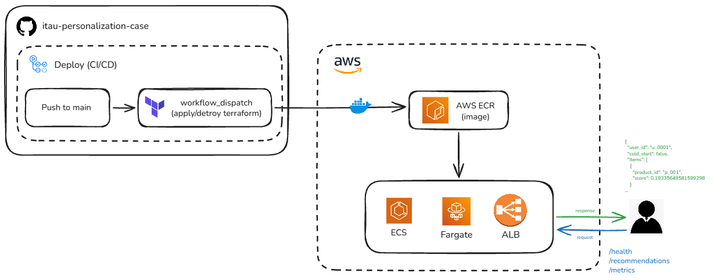

# Personalization Case - Itaú

## Visão Geral

Microserviço que serve recomendações de produtos personalizadas via API, usando um modelo de propensão de compra já treinado.

## Arquitetura da Solução



## Fluxo da API de Propensão de Compra

1. **Processamento de dados**: `events.csv` e `products.csv` são processados em memória no startup da API (dado estático, sem fase de treinamento — não há necessidade de pipeline de ingestão contínuo).
2. **Cálculo de features**: as 5 features do `model_card.json` são derivadas dos dados pré-processados, respeitando a ordem exata (`feature_cols`) esperada pelo modelo.
3. **Endpoint de recomendação**: roda o modelo sobre o catálogo e retorna os top N produtos ranqueados por score.
4. **Cold start**: usuários sem histórico recebem um ranking por popularidade agregada com diversidade de categoria, sem rodar o modelo.
5. **Observabilidade**: logs JSON estruturados e métricas Prometheus (`/metrics`) em cada requisição.
6. **Deploy**: CI/CD via GitHub Actions builda a imagem, publica no ECR e aplica a infraestrutura (Terraform) na AWS.

## API

### Rodando localmente

```bash
make build   # builda a imagem Docker
make run     # sobe o container (porta 8000)
make logs    # acompanha os logs
make stop    # para o container
```

Swagger interativo: `http://localhost:8000/docs`

### Arquivo `.env`

Copie `.env.example` para `.env` — os valores default já funcionam sem alteração:

| Variável | Descrição |
|---|---|
| `EVENTS_PATH` | Caminho do `events.csv` |
| `PRODUCTS_PATH` | Caminho do `products.csv` |
| `MODEL_PATH` | Caminho do `model.pkl` |
| `TOP_N_RECOMMENDATIONS` | Quantos produtos retornar por recomendação |
| `LOG_LEVEL` | Nível de log (`INFO`, `DEBUG`, etc.) |

### Endpoints

| Método | Rota | Descrição |
|---|---|---|
| `GET` | `/health` | Health check |
| `GET` | `/recommendations/{user_id}` | Lista ranqueada de produtos recomendados para o usuário |
| `GET` | `/metrics` | Métricas no formato Prometheus |

## Cold Start

1. Verifica se o `user_id` existe no histórico de `events.csv`.
2. Se não existir, ativa o fallback: ranking por popularidade agregada dos últimos 30 dias, ponderada por tipo de evento (funil: view < click < add_to_cart < purchase).
3. Aplica uma cota de diversidade: garante ao menos 1 produto de cada categoria antes de completar a lista com os demais mais populares.
4. O modelo não é executado nesse caminho — o campo `score` retorna `null`, evitando expor um número pouco confiável.

## Observabilidade

- **Logs estruturados (JSON)**: cada requisição de recomendação loga `user_id`, `cold_start` e `duration_ms`.
- **Métricas Prometheus** (`/metrics`): contagem de requisições, latência por rota, taxa de cold start e distribuição do score do modelo.
- Detalhes completos e decisões de trade-off em [SOLUTION.md](SOLUTION.md).

## Requisitos

- Python >= 3.12
- [uv](https://docs.astral.sh/uv/) (gerenciador de pacotes)
- Docker (para build/run via Makefile)
- Conta AWS + Terraform (apenas para deploy em nuvem — não necessário para rodar local)

## Secrets do Github

Necessários no repositório (Settings → Secrets → Actions) para o workflow de deploy:

| Secret | Descrição |
|---|---|
| `AWS_ACCESS_KEY_ID` | Credencial AWS |
| `AWS_SECRET_ACCESS_KEY` | Credencial AWS |
| `AWS_REGION` | Região AWS (ex: `us-east-1`) |
| `ECR_REPOSITORY` | Nome do repositório ECR |
| `TF_STATE_BUCKET` | Bucket S3 onde fica o `terraform.tfstate` |

## Informações do terraform

- Backend remoto em S3, chave `itau/terraform.tfstate` — bucket definido pelo secret `TF_STATE_BUCKET`
- Lock de state via `use_lockfile = true` (lock nativo do backend S3, sem necessidade de tabela DynamoDB)
- `terraform init` recebe o bucket/região via `-backend-config` no próprio workflow do CI/CD

## Melhorias Futuras

_(a preencher)_
